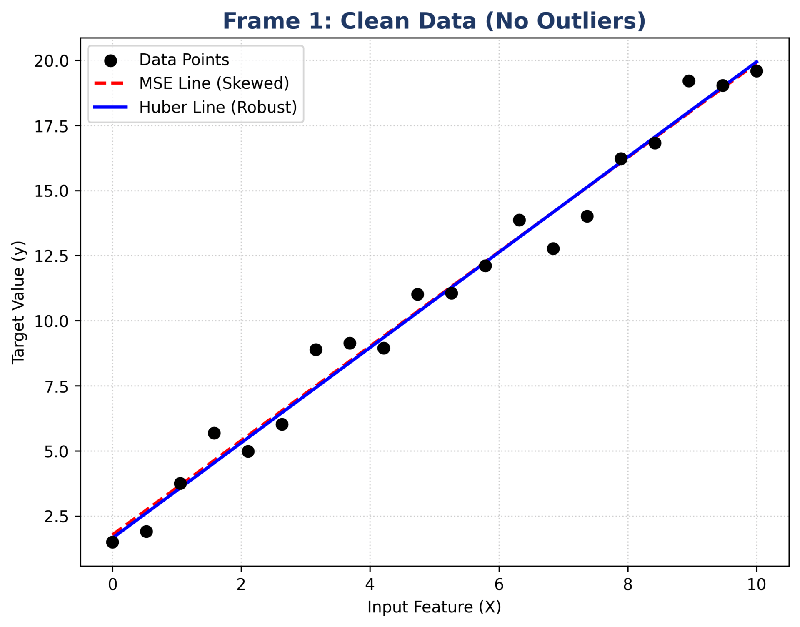

# Huber Loss vs. MSE: Robust Regression Visualization

This repository contains the Python implementation for my **Applied Machine Learning (CSAI2017P) Mid-Semester Assignment**. 

The goal of this project is to visually demonstrate why **Huber Loss** is a highly robust alternative to **Mean Squared Error (MSE)** when dealing with noisy, real-world data that contains extreme outliers.

## 📈 Visualization of Huber Loss


## 🧠 What the Code Does
The `main.py` script generates a synthetic linear dataset and trains two models simultaneously:
1. A standard Linear Regression model (uses MSE).
2. A Huber Regressor (uses Huber Loss).

It then progressively injects massive anomalies (outliers) into the dataset across 4 stages. As the data gets messier, you can clearly see the MSE regression line get severely skewed by the outliers, while the Huber Regression line ignores them and stays perfectly aligned with the true data trend.

## ⚙️ How to Run

**1. Install the dependencies:**
Make sure you have Python installed, then install the required libraries using the `requirements.txt` file:
```bash
pip install -r requirements.txt
